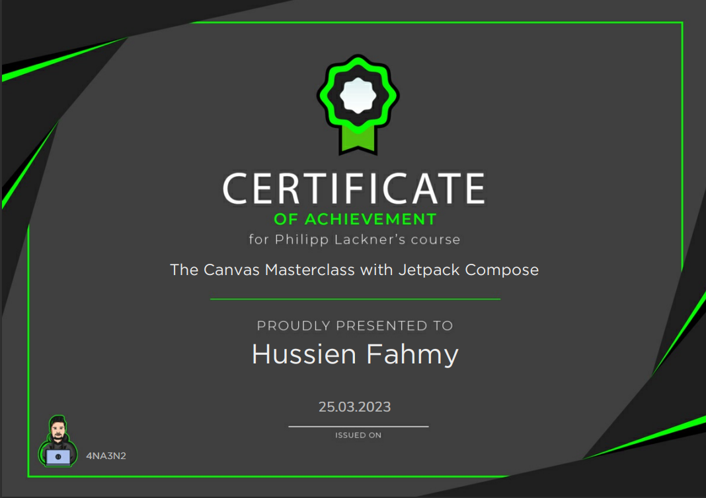

# The Canvas Masterclass with Jetpack Compose

## What I have learnt

The course "The Canvas Masterclass with Jetpack compose" focuses on teaching developers how to
create custom user interfaces for Android applications with Jetpack Compose. The course covers the
following topics:

- Canvas basics, including the coordinate system, basic shapes, trigonometry, detecting touch input,
  drawing text.
- Drawing paths and using them to create custom shapes and animations, animating a path line,
  writing text along a path, making a gender picker, and using transformations and clipping.
- Images, blend modes, and color filters.

The course is taught by Philipp Lackner, who has over 11 years of experience in the software field.

## Video Demo

https://user-images.githubusercontent.com/65970301/227927804-a6722756-0b10-4883-aa40-8cbbc64a8ba4.mp4

## Certificate

